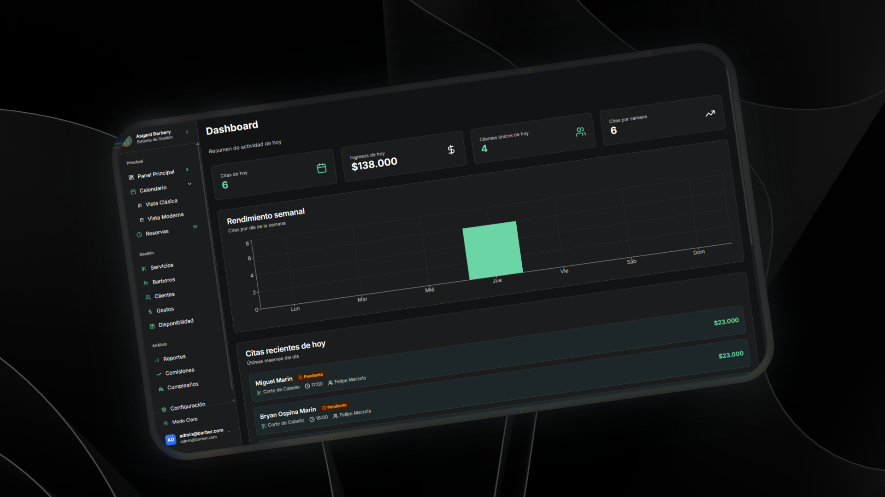

# BarberApp Landing Page 💈

[](https://nextjs.org/)
[](https://www.typescriptlang.org/)
[](https://tailwindcss.com/)
[](https://www.framer.com/motion/)

A modern, responsive landing page for BarberApp - the all-in-one barbershop management solution. Built with Next.js 15, TypeScript, and Tailwind CSS.



## ✨ Features

### 🎨 Modern Design
- **Responsive Design**: Mobile-first approach with seamless desktop experience
- **Dark/Light Mode**: Automatic theme switching with persistent preferences
- **Smooth Animations**: Framer Motion powered interactions and page transitions
- **Professional UI**: Clean, modern interface using shadcn/ui components

### 🌍 Internationalization
- **Bilingual Support**: Complete Spanish and English translations
- **Dynamic Language Switching**: Instant language toggle with intuitive UI
- **Localized Content**: Professional translations for all legal and marketing content

### 🚀 Performance
- **Next.js 15**: Latest framework with App Router for optimal performance
- **Server Components**: Efficient rendering and reduced JavaScript bundle
- **Image Optimization**: Automatic image optimization and lazy loading
- **SEO Optimized**: Meta tags, structured data, and search engine friendly URLs

### 📄 Legal Compliance
- **Privacy Policy**: Comprehensive data protection documentation
- **Terms of Service**: Detailed service terms and user agreements
- **Cookie Policy**: Complete cookie usage and management information
- **Cross-Navigation**: Seamless navigation between all legal documents

### 🎯 Business Features
- **Interactive Dashboard Preview**: Carousel showcase of real application screenshots
- **Brand Carousel**: Infinite scrolling logos with hover effects and animations
- **3D Globe Visualization**: Interactive globe component showing global reach
- **Testimonials**: Dynamic testimonial carousel with user feedback
- **Pricing Section**: Clear one-time payment model with detailed features
- **FAQ Section**: Comprehensive answers to common questions

### 📱 User Experience
- **Smooth Scrolling**: Enhanced navigation with smooth scroll behavior
- **Back to Top**: Animated floating button for easy navigation
- **Mobile Menu**: Responsive hamburger menu for mobile devices
- **Contact Integration**: Direct WhatsApp integration for customer inquiries
- **Loading States**: Proper loading states and error handling

## 🛠️ Tech Stack

### Core Technologies
- **[Next.js 15](https://nextjs.org/)** - React framework with App Router
- **[TypeScript](https://www.typescriptlang.org/)** - Type-safe JavaScript
- **[Tailwind CSS](https://tailwindcss.com/)** - Utility-first CSS framework
- **[Framer Motion](https://www.framer.com/motion/)** - Animation library

### UI Components
- **[shadcn/ui](https://ui.shadcn.com/)** - Modern component library
- **[Lucide React](https://lucide.dev/)** - Beautiful icon library
- **[next-themes](https://github.com/pacocoursey/next-themes)** - Theme management

### 3D & Visualization
- **[Three.js](https://threejs.org/)** - 3D graphics library
- **[React Three Fiber](https://docs.pmnd.rs/react-three-fiber)** - React renderer for Three.js
- **[React Three Drei](https://github.com/pmndrs/drei)** - Useful helpers for R3F

## 📁 Project Structure

```
saas-landing-page/
├── 📁 app/                          # Next.js App Router
│   ├── 📄 globals.css              # Global styles and animations
│   ├── 📄 layout.tsx               # Root layout with providers
│   ├── 📄 page.tsx                 # Main landing page
│   ├── 📁 privacy-policy/          # Privacy policy page
│   ├── 📁 terms-of-service/        # Terms of service page
│   └── 📁 cookie-policy/           # Cookie policy page
├── 📁 components/                   # React components
│   ├── 📄 brand-carousel.tsx       # Infinite brand logos carousel
│   ├── 📄 globe-demo.tsx           # 3D interactive globe
│   ├── 📄 theme-provider.tsx       # Theme context provider
│   └── 📁 ui/                      # shadcn/ui components
│       ├── 📄 accordion.tsx        # Collapsible content
│       ├── 📄 button.tsx           # Button variants
│       ├── 📄 card.tsx             # Card components
│       ├── 📄 testimonials.tsx     # Testimonial carousel
│       └── ... (30+ components)
├── 📁 data/                        # Static data files
│   └── 📄 globe.json              # Geographic data for globe
├── 📁 hooks/                       # Custom React hooks
│   ├── 📄 use-mobile.tsx          # Mobile device detection
│   └── 📄 use-toast.ts            # Toast notifications
├── 📁 lib/                         # Utility libraries
│   └── 📄 utils.ts                # Helper functions and utilities
├── 📁 public/                      # Static assets
│   ├── 📁 images/                  # Application screenshots
│   └── 📄 *.svg                   # Icons and logos
├── 📁 styles/                      # Additional styles
│   └── 📄 globals.css             # Legacy global styles
├── 📄 components.json              # shadcn/ui configuration
├── 📄 next.config.mjs             # Next.js configuration
├── 📄 package.json                # Dependencies and scripts
├── 📄 tailwind.config.js          # Tailwind CSS configuration
└── 📄 tsconfig.json               # TypeScript configuration
```

## 🚀 Getting Started

### Prerequisites

- **Node.js** 18.0 or later
- **pnpm** (recommended) or npm
- **Git** for version control

### Installation

1. **Clone the repository**
   ```bash
   git clone https://github.com/yourusername/saas-landing-page.git
   cd saas-landing-page
   ```

2. **Install dependencies**
   ```bash
   pnpm install
   # or
   npm install
   ```

3. **Start the development server**
   ```bash
   pnpm dev
   # or
   npm run dev
   ```

4. **Open your browser**
   Navigate to [http://localhost:3000](http://localhost:3000)

### Build for Production

```bash
# Build the application
pnpm build

# Start production server
pnpm start

# Export static files (optional)
pnpm export
```

## 🎨 Customization

### Branding
1. Replace logos in `/public/` directory
2. Update brand colors in `tailwind.config.js`
3. Modify company information in translation files

### Content
1. Edit translations in each page's `translations` object
2. Update images in `/public/images/` directory
3. Modify contact information and WhatsApp numbers

### Styling
1. Global styles: `app/globals.css`
2. Component styles: Tailwind classes in components
3. Custom animations: Framer Motion configurations

### Legal Pages
1. **Privacy Policy**: `app/privacy-policy/page.tsx`
2. **Terms of Service**: `app/terms-of-service/page.tsx`
3. **Cookie Policy**: `app/cookie-policy/page.tsx`

## 🌍 Internationalization

The application supports full bilingual functionality:

### Supported Languages
- 🇪🇸 **Spanish (Español)** - Primary language
- 🇺🇸 **English** - Secondary language

### Translation Structure
```typescript
const translations = {
  es: {
    // Spanish translations
    heroTitle: "Revoluciona tu Barbería con BarberApp",
    // ... more translations
  },
  en: {
    // English translations
    heroTitle: "Revolutionize Your Barbershop with BarberApp",
    // ... more translations
  }
}
```

### Adding New Languages
1. Extend the `translations` object in each page
2. Add language toggle logic in components
3. Update language switching UI

## 📝 Contributing

We welcome contributions! Please see our [Contributing Guide](CONTRIBUTING.md) for details.

### Development Workflow
1. Fork the repository
2. Create a feature branch: `git checkout -b feature/amazing-feature`
3. Commit changes: `git commit -m 'feat: add amazing feature'`
4. Push to branch: `git push origin feature/amazing-feature`
5. Open a Pull Request

### Commit Convention
We follow [Conventional Commits](https://www.conventionalcommits.org/):

- `feat:` - New features
- `fix:` - Bug fixes
- `docs:` - Documentation changes
- `style:` - Code style changes
- `refactor:` - Code refactoring
- `test:` - Test additions/modifications
- `chore:` - Maintenance tasks

## 📄 License

This project is licensed under the **MIT License** - see the [LICENSE](LICENSE) file for details.

## 🤝 Support

### Contact Information
- **Email**: support@barberapp.com
- **WhatsApp**: +1 (234) 567-890
- **Website**: [https://barberapp.com](https://barberapp.com)

### Legal Contacts
- **Privacy**: privacy@barberapp.com
- **Legal**: legal@barberapp.com
- **Cookies**: cookies@barberapp.com

## 🙏 Acknowledgments

- [shadcn/ui](https://ui.shadcn.com/) for the amazing component library
- [Lucide](https://lucide.dev/) for beautiful icons
- [Tailwind CSS](https://tailwindcss.com/) for the utility-first CSS framework
- [Framer Motion](https://www.framer.com/motion/) for smooth animations
- [Next.js](https://nextjs.org/) team for the excellent framework

---

Made with ❤️ for barbershops worldwide 