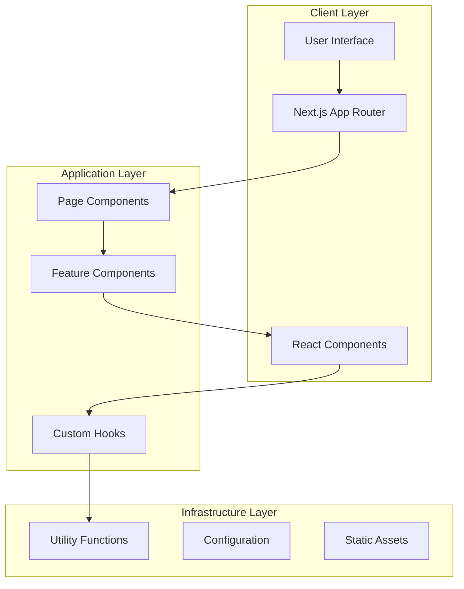
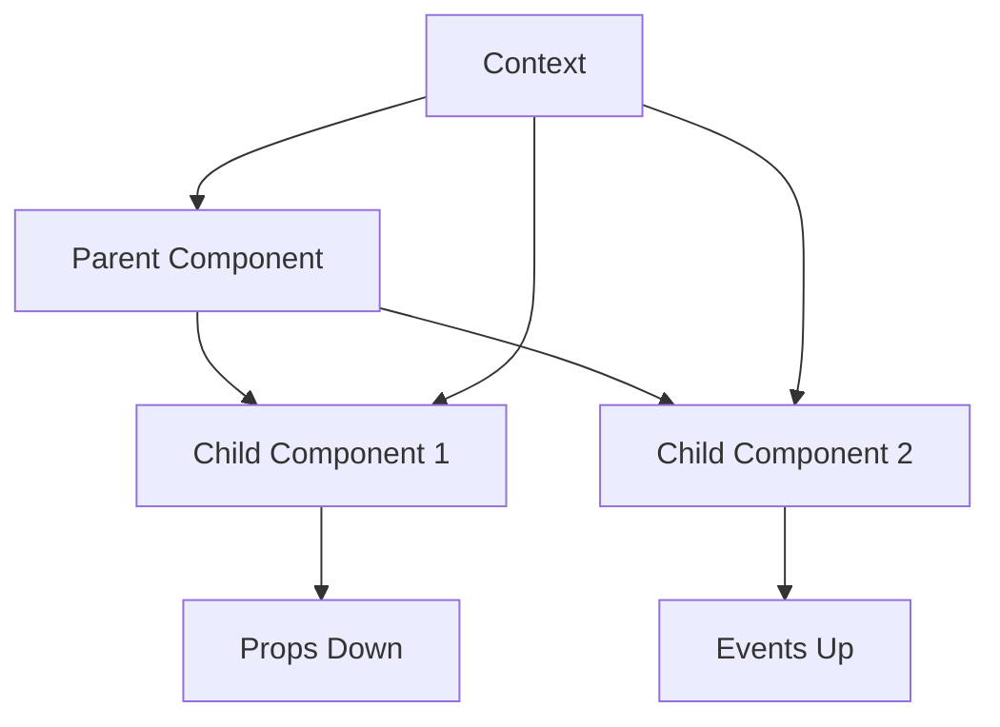

# BarberApp Architecture Documentation 🏗️

This document provides a comprehensive overview of the BarberApp landing page architecture, including design decisions, patterns, and technical implementation details.

## 📊 Architecture Overview

BarberApp follows a modern, component-based architecture using Next.js 15 with the App Router pattern. The application is designed for scalability, maintainability, and optimal performance.



## 🏛️ Core Principles

### 1. Component-Driven Development
- **Atomic Design**: Components are organized in a hierarchical structure
- **Reusability**: Components are designed to be reusable across different contexts
- **Composability**: Complex UIs are built by composing simpler components

### 2. Type Safety
- **TypeScript First**: All components and functions are strictly typed
- **Interface Definitions**: Clear contracts between components
- **Runtime Safety**: Type checking prevents common errors

### 3. Performance Optimization
- **Server Components**: Leverage Next.js server components where possible
- **Code Splitting**: Automatic code splitting for optimal bundle sizes
- **Image Optimization**: Next.js Image component for optimized loading
- **Lazy Loading**: Components and resources loaded on demand

### 4. Accessibility
- **WCAG Compliance**: Following Web Content Accessibility Guidelines
- **Semantic HTML**: Proper HTML structure and ARIA attributes
- **Keyboard Navigation**: Full keyboard accessibility support
- **Screen Reader Support**: Optimized for assistive technologies

## 📁 Directory Structure

```
saas-landing-page/
├── 📁 app/                          # Next.js App Router
│   ├── 📄 globals.css              # Global styles and CSS variables
│   ├── 📄 layout.tsx               # Root layout with providers
│   ├── 📄 page.tsx                 # Main landing page
│   ├── 📁 privacy-policy/          # Privacy policy route
│   ├── 📁 terms-of-service/        # Terms of service route
│   └── 📁 cookie-policy/           # Cookie policy route
├── 📁 components/                   # React components
│   ├── 📄 brand-carousel.tsx       # Brand logos carousel
│   ├── 📄 globe-demo.tsx           # 3D globe visualization
│   ├── 📄 theme-provider.tsx       # Theme context provider
│   └── 📁 ui/                      # shadcn/ui components
├── 📁 hooks/                       # Custom React hooks
├── 📁 lib/                         # Utility libraries
├── 📁 data/                        # Static data files
└── 📁 public/                      # Static assets
```

## 🧩 Component Architecture

### Component Hierarchy

```
App Layout (layout.tsx)
├── Theme Provider
├── Page Components
│   ├── Header
│   │   ├── Navigation
│   │   ├── Language Toggle
│   │   └── Theme Toggle
│   ├── Main Content
│   │   ├── Hero Section
│   │   ├── Brand Carousel
│   │   ├── Features Section
│   │   ├── Globe Section
│   │   ├── Testimonials
│   │   ├── Pricing
│   │   └── FAQ
│   └── Footer
│       ├── Links
│       └── Legal Links
└── Back to Top Button
```

### Component Types

#### 1. Layout Components
```typescript
// Root layout component
export default function RootLayout({ children }: { children: React.ReactNode }) {
  return (
    <html lang="en" suppressHydrationWarning>
      <body>
        <ThemeProvider>
          {children}
        </ThemeProvider>
      </body>
    </html>
  );
}
```

#### 2. Page Components
```typescript
// Main landing page
export default function LandingPage() {
  const [language, setLanguage] = useState<"es" | "en">("es");
  
  return (
    <div className="flex min-h-[100dvh] flex-col">
      <Header language={language} onLanguageChange={setLanguage} />
      <Main language={language} />
      <Footer language={language} />
    </div>
  );
}
```

#### 3. Feature Components
```typescript
// Complex feature with internal state
export function BrandCarousel({ trustedBy }: BrandCarouselProps) {
  const [isPaused, setIsPaused] = useState(false);
  
  useEffect(() => {
    // Animation logic
  }, [isPaused]);
  
  return (
    <section className="brand-carousel">
      {/* Carousel implementation */}
    </section>
  );
}
```

#### 4. UI Components
```typescript
// Reusable UI component
interface ButtonProps extends React.ButtonHTMLAttributes<HTMLButtonElement> {
  variant?: 'default' | 'destructive' | 'outline' | 'secondary' | 'ghost' | 'link';
  size?: 'default' | 'sm' | 'lg' | 'icon';
}

export const Button = React.forwardRef<HTMLButtonElement, ButtonProps>(
  ({ className, variant = 'default', size = 'default', ...props }, ref) => {
    return (
      <button
        className={cn(buttonVariants({ variant, size, className }))}
        ref={ref}
        {...props}
      />
    );
  }
);
```

## 🎨 Styling Architecture

### Design System

```typescript
// Tailwind configuration
module.exports = {
  theme: {
    extend: {
      colors: {
        primary: {
          DEFAULT: 'hsl(var(--primary))',
          foreground: 'hsl(var(--primary-foreground))'
        },
        // ... more colors
      },
      animation: {
        'pulse-green': 'pulse-green 2s ease-in-out infinite',
        'scroll': 'scroll 40s linear infinite'
      }
    }
  }
};
```

### CSS Architecture

```css
/* Global styles with CSS variables */
:root {
  --background: 0 0% 100%;
  --foreground: 222.2 84% 4.9%;
  --primary: 222.2 47.4% 11.2%;
  --primary-foreground: 210 40% 98%;
  /* ... more variables */
}

[data-theme="dark"] {
  --background: 222.2 84% 4.9%;
  --foreground: 210 40% 98%;
  /* ... dark theme variables */
}
```

### Component Styling Patterns

```typescript
// Utility-first approach with Tailwind
const styles = {
  container: "container mx-auto px-4 md:px-6",
  section: "w-full py-20 md:py-32",
  heading: "text-3xl md:text-4xl font-bold tracking-tight",
  card: "rounded-xl border bg-card text-card-foreground shadow"
};

// Responsive design patterns
<div className="grid grid-cols-1 md:grid-cols-2 lg:grid-cols-3 gap-6">
  {/* Grid items */}
</div>

// Dark mode support
<div className="bg-white dark:bg-gray-900 text-gray-900 dark:text-white">
  {/* Content */}
</div>
```

## 🌍 Internationalization Architecture

### Translation Structure

```typescript
// Translation interface
interface Translations {
  es: TranslationSet;
  en: TranslationSet;
}

interface TranslationSet {
  // Header
  features: string;
  testimonials: string;
  pricing: string;
  
  // Page content
  heroTitle: string;
  heroSubtitle: string;
  
  // Components
  [key: string]: string;
}

// Usage pattern
const t = translations[language];
return <h1>{t.heroTitle}</h1>;
```

### Language Management

```typescript
// Language context
export function LanguageProvider({ children }: { children: React.ReactNode }) {
  const [language, setLanguage] = useState<'es' | 'en'>('es');
  
  const toggleLanguage = () => {
    setLanguage(prev => prev === 'es' ? 'en' : 'es');
  };
  
  return (
    <LanguageContext.Provider value={{ language, toggleLanguage }}>
      {children}
    </LanguageContext.Provider>
  );
}
```

## 🎭 State Management

### Local State
- **React hooks** for component-level state
- **useState** for simple state
- **useEffect** for side effects
- **useCallback** and **useMemo** for performance optimization

### Global State
- **React Context** for theme management
- **Next.js built-in state** for routing
- **localStorage** for persistence (theme, language preferences)

### State Patterns

```typescript
// Theme state management
export function ThemeProvider({ children }: ThemeProviderProps) {
  const [theme, setTheme] = useState<Theme>('system');
  
  useEffect(() => {
    const storedTheme = localStorage.getItem('theme') as Theme;
    if (storedTheme) {
      setTheme(storedTheme);
    }
  }, []);
  
  const toggleTheme = () => {
    const newTheme = theme === 'dark' ? 'light' : 'dark';
    setTheme(newTheme);
    localStorage.setItem('theme', newTheme);
  };
  
  return (
    <ThemeContext.Provider value={{ theme, toggleTheme }}>
      {children}
    </ThemeContext.Provider>
  );
}
```

## 🚀 Performance Architecture

### Optimization Strategies

#### 1. Code Splitting
```typescript
// Dynamic imports for heavy components
const GlobeDemo = dynamic(() => import('@/components/globe-demo'), {
  loading: () => <div className="loading-placeholder">Loading...</div>,
  ssr: false // Client-side only for 3D components
});
```

#### 2. Image Optimization
```typescript
import Image from 'next/image';

<Image
  src="/images/dashboard-principal.png"
  width={1280}
  height={720}
  alt="Dashboard preview"
  priority={index === 0} // Priority for first image
  className="object-cover"
/>
```

#### 3. Animation Performance
```typescript
// Framer Motion optimizations
const optimizedVariants = {
  hidden: { opacity: 0, y: 20 },
  visible: { 
    opacity: 1, 
    y: 0,
    transition: {
      duration: 0.5,
      ease: "easeOut"
    }
  }
};
```

### Bundle Analysis

```javascript
// webpack-bundle-analyzer integration
const withBundleAnalyzer = require('@next/bundle-analyzer')({
  enabled: process.env.ANALYZE === 'true',
});

module.exports = withBundleAnalyzer({
  // Next.js config
});
```

## 🔒 Security Considerations

### Content Security Policy
```typescript
// next.config.js
const securityHeaders = [
  {
    key: 'Content-Security-Policy',
    value: "default-src 'self'; script-src 'self' 'unsafe-eval'; style-src 'self' 'unsafe-inline';"
  }
];
```

### Input Sanitization
```typescript
// Form validation and sanitization
import { z } from 'zod';

const contactSchema = z.object({
  name: z.string().min(1).max(100),
  email: z.string().email(),
  message: z.string().min(10).max(1000)
});
```

## 📊 Monitoring and Analytics

### Performance Monitoring
```typescript
// Core Web Vitals tracking
export function reportWebVitals(metric: NextWebVitalsMetric) {
  console.log(metric);
  
  // Send to analytics service
  if (process.env.NODE_ENV === 'production') {
    analytics.track('web-vital', {
      name: metric.name,
      value: metric.value,
      id: metric.id
    });
  }
}
```

### Error Boundary
```typescript
class ErrorBoundary extends React.Component {
  constructor(props: Props) {
    super(props);
    this.state = { hasError: false };
  }
  
  static getDerivedStateFromError(error: Error) {
    return { hasError: true };
  }
  
  componentDidCatch(error: Error, errorInfo: React.ErrorInfo) {
    console.error('Error caught by boundary:', error, errorInfo);
  }
  
  render() {
    if (this.state.hasError) {
      return <ErrorFallback />;
    }
    
    return this.props.children;
  }
}
```

## 🔄 Data Flow

### Component Communication



### Event Handling
```typescript
// Event bubbling pattern
const handleNavigation = useCallback((section: string) => {
  document.getElementById(section)?.scrollIntoView({
    behavior: 'smooth'
  });
}, []);

// Event delegation
<nav onClick={(e) => {
  const target = e.target as HTMLElement;
  if (target.dataset.section) {
    handleNavigation(target.dataset.section);
  }
}}>
  {/* Navigation items */}
</nav>
```

## 🧪 Testing Architecture

### Testing Strategy
- **Unit Tests**: Component logic and utilities
- **Integration Tests**: Component interactions
- **E2E Tests**: User journeys and workflows
- **Visual Tests**: Component appearance and responsive design
- **Accessibility Tests**: WCAG compliance and screen reader support

### Testing Tools
```typescript
// Jest configuration
module.exports = {
  testEnvironment: 'jsdom',
  setupFilesAfterEnv: ['<rootDir>/jest.setup.js'],
  moduleNameMapping: {
    '^@/(.*)$': '<rootDir>/$1'
  }
};

// Component testing example
import { render, screen } from '@testing-library/react';
import { Button } from '@/components/ui/button';

describe('Button', () => {
  it('renders with correct variant', () => {
    render(<Button variant="primary">Click me</Button>);
    expect(screen.getByRole('button')).toHaveClass('btn-primary');
  });
});
```

## 🔧 Build and Deployment

### Build Pipeline
```yaml
# GitHub Actions workflow
name: Build and Deploy
on:
  push:
    branches: [main]

jobs:
  build:
    runs-on: ubuntu-latest
    steps:
      - uses: actions/checkout@v3
      - uses: actions/setup-node@v3
      - run: pnpm install
      - run: pnpm build
      - run: pnpm test
```

### Environment Configuration
```typescript
// Environment variables
const config = {
  development: {
    apiUrl: 'http://localhost:3000',
    analytics: false
  },
  production: {
    apiUrl: 'https://barberapp.com',
    analytics: true
  }
};
```

## 📈 Future Considerations

### Scalability
- **Micro-frontends**: Split into smaller, independent applications
- **CDN Integration**: Global content delivery
- **Edge Computing**: Server-side rendering at the edge

### Performance
- **Service Workers**: Offline functionality and caching
- **WebAssembly**: Heavy computations (3D rendering)
- **HTTP/3**: Next-generation protocol support

### Features
- **Progressive Web App**: Native app-like experience
- **Advanced Analytics**: User behavior tracking
- **A/B Testing**: Feature experimentation platform

---

This architecture documentation is a living document that should be updated as the application evolves. For questions or suggestions, please open an issue or contact the development team. 